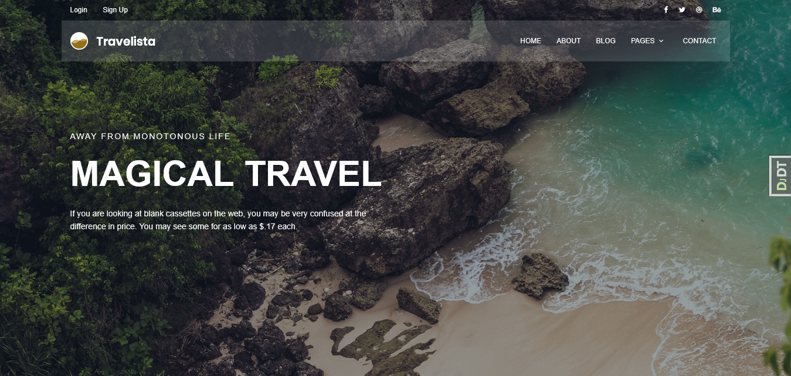
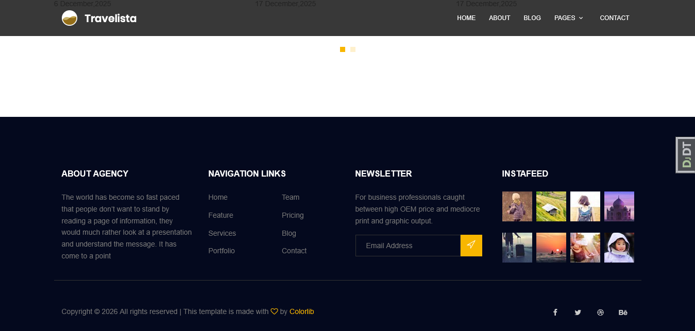
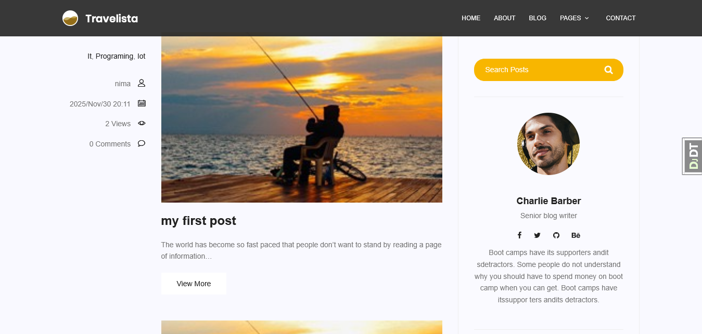
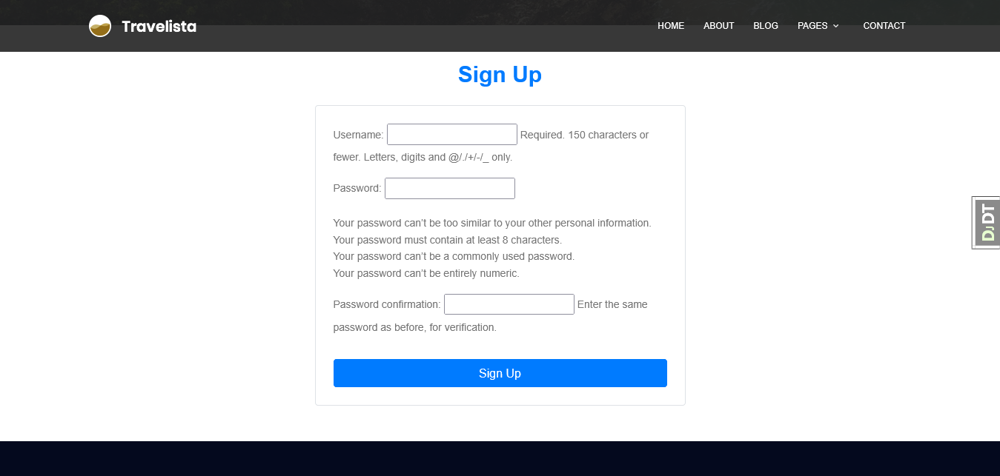

# Blog Site

A modern blog platform built with Django, featuring user authentication, blog management, categories, tags, RSS feeds, and SEO-friendly features.

---

## 🚀 Features

- User Registration & Authentication
- Password Management
- Blog Post Management
- Categories & Tags
- Contact Form
- RSS Feed Support
- Sitemap for SEO
- Django Admin Panel
- Responsive Design with Bootstrap

---

## 🛠️ Tech Stack

- Python
- Django
- PostgreSQL
- Gunicorn
- Nginx
- Docker & Docker Compose
- Bootstrap
- HTML5 / CSS3 / JavaScript

---

## 📂 Project Structure

```text
Blog-Site/
│
├── accounts/
├── blog/
├── contact/
├── core/
├── media/
├── mysite/
├── nginx/
│   └── nginx.conf
├── screenshots/
├── static/
├── templates/
├── Dockerfile
├── docker-compose.yml
├── docker-compose.prod.yml
├── wait-for-it.sh
├── .env.example
├── .gitignore
├── .dockerignore
├── requirements.txt
└── manage.py
```

---

## ⚙️ Installation & Setup

### Prerequisites

- [Docker](https://docs.docker.com/get-docker/)
- [Docker Compose](https://docs.docker.com/compose/install/)

---

### 1. Clone the repository

```bash
git clone https://github.com/Nimam217/Blog-Site.git
cd Blog-Site
```

### 2. Create the `.env` file

```bash
cp .env.example .env
```

Then edit `.env` and fill in your values:

```
SECRET_KEY=your_secret_key_here
DEBUG=0
POSTGRES_DB=mydb
POSTGRES_USER=myuser
POSTGRES_PASSWORD=your_password_here
```

To generate a secure `SECRET_KEY`:

```bash
python3 -c "from django.core.management.utils import get_random_secret_key; print(get_random_secret_key())"
```

### 3. Build and run

```bash
docker-compose up --build
```

The app will be available at:

```
http://localhost
```

### 4. Run in background

```bash
docker-compose up -d --build
```

---

## 🐳 Docker Services

| Service | Description |
|---------|-------------|
| `web` | Django app served by Gunicorn |
| `db` | PostgreSQL database |
| `nginx` | Reverse proxy & static file server |

---

## 📋 Useful Commands

```bash
# Stop all containers
docker-compose down

# Stop and remove volumes (clears database)
docker-compose down -v

# View logs
docker-compose logs web
docker-compose logs nginx

# Enter the web container
docker exec -it <container_name> bash

# Check container status
docker-compose ps
```

---

## 📈 Future Improvements

- Comment System
- User Profiles
- REST API with Django REST Framework
- Like & Bookmark Features

---

## 📸 Screenshots

### Home Page





### Blog List



### Sign Up



---

## 📄 License

This project is licensed under the MIT License.
